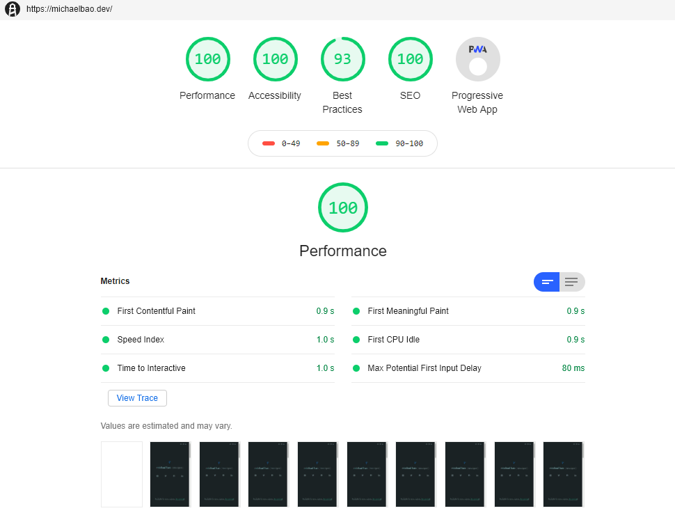

# GatsbyPortfolio

<p align="center">
  <a href="https://michaelbao.dev"></a>
 </p>
<h2 align="center">
        Portfolio built with <a href="https://www.gatsbyjs.org">Gatsby</a>.
</h2>
<p align="center">
  <a href="michaelbao.dev">michaelbao.dev</a>
</p>


## Features

The whole [portfolio](https://michaelbao.dev) is a React-based Single Page App built with [Gatsby v2](https://www.gatsbyjs.org).


## Contents

All content is powered by one YAML file where all the portfolio's projects are defined. The project description itself is transformed from Markdown written inside the YAML file into HTML on build time.

Gatsby automatically creates pages from each item in that file utilizing the [`Project.jsx`](src/templates/Project.jsx) template.

- [`gatsby-node.js`](gatsby-node.js)
- [`content/projects.yml`](content/projects.yml)
- [`src/templates/Project.jsx`](src/templates/Project.jsx)


## Project images

All project images live under `content/images` and are automatically attached to each project based on the inclusion of the project's `slug` in their filenames.

All project images make use of the excellent [gatsby-image](https://github.com/gatsbyjs/gatsby/tree/master/packages/gatsby-image) plugin, working in tandem with [gatsby-plugin-sharp](https://github.com/gatsbyjs/gatsby/tree/master/packages/gatsby-plugin-sharp) and [gatsby-transformer-sharp](https://github.com/gatsbyjs/gatsby/tree/master/packages/gatsby-transformer-sharp).

All together, Gatsby automatically generates all required image sizes for delivering responsible, responsive images to visitors, including lazy loading of all images. Also includes the [intersection-observer polyfill](https://github.com/w3c/IntersectionObserver) to make lazy loading work properly in Safari.

All project images use one single component where one main GraphQL query fragment is defined, which then gets used throughout other GraphQL queries.

- [`src/components/molecules/ProjectImage.jsx`](src/components/molecules/ProjectImage.jsx)


## Theme switcher

There is a theme switcher which allows user to toggle between a light and a dark theme.

If a visitor has set the theme manually that selection is remembered in `localStorage`, and is restored on next visit.

If you want to know how, have a look at the respective components:

- [`src/components/molecules/ThemeSwitch.jsx`](src/components/molecules/ThemeSwitch.jsx)
- [`src/store/provider.jsx`](src/store/provider.jsx)

## Importing SVG assets

All SVG assets under `src/images/` will be converted to React components with the help of [gatsby-plugin-svgr](https://github.com/zabute/gatsby-plugin-svgr). Makes use of [SVGR](https://github.com/smooth-code/svgr) so SVG assets can be imported like so:

```js
import { ReactComponent as Logo } from './components/svg/Logo'

return <Logo />
```

## Development

You can simply use [Docker](https://www.docker.com) & [Docker Compose](https://docs.docker.com/compose/) or install and run dependencies on your local system.

```bash
git clone

# use Docker
docker-compose up

# or go with local system
npm i
npm start
```
## Lighthough

<p align="center">
  <a href="https://michaelbao.dev"></a>
</p>
